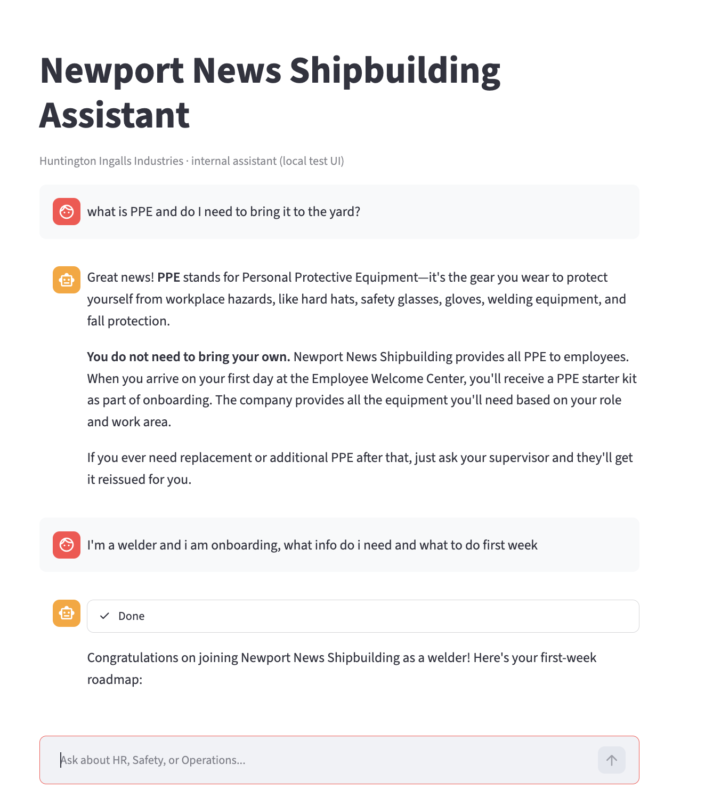
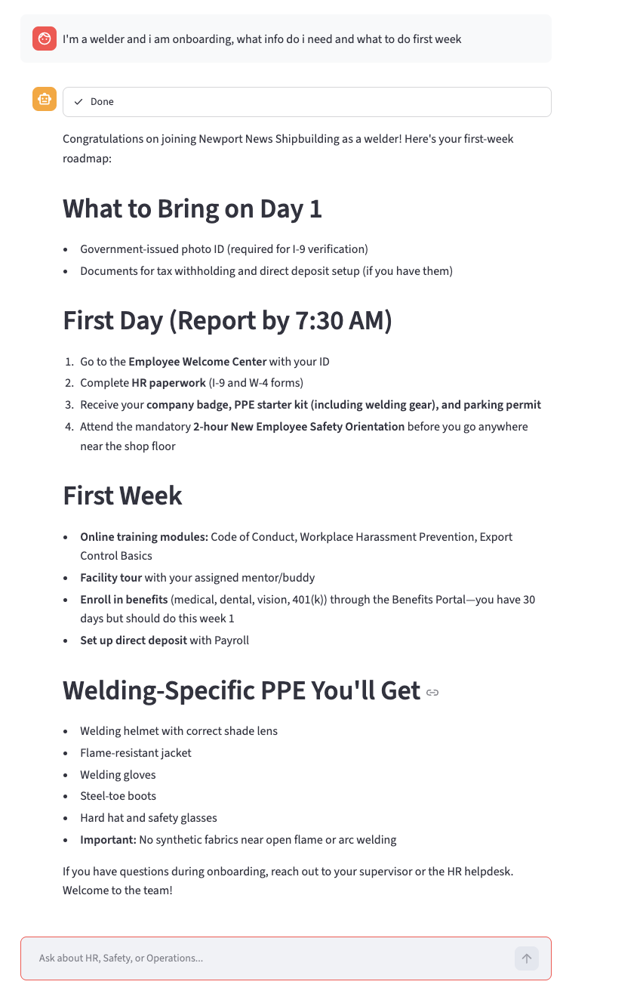
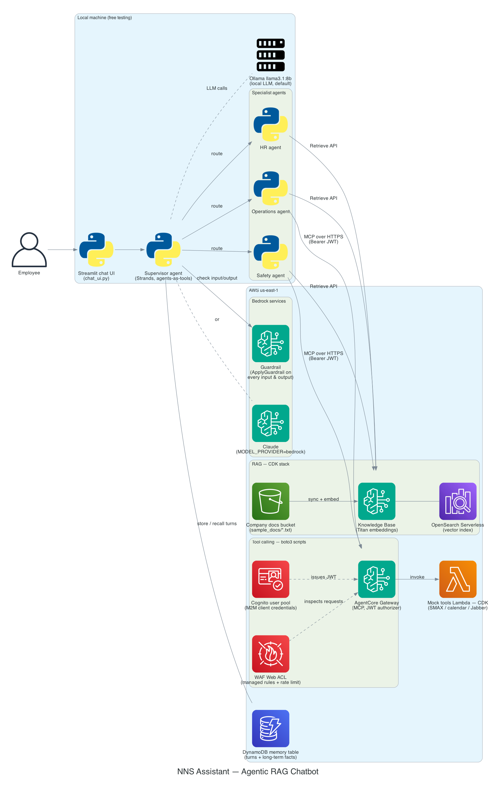

# NNS Agentic RAG Chatbot

A practice / learning project: an agentic **RAG-powered multi-agent chatbot** for a fictional
shipbuilding-style company. It uses **AWS Bedrock AgentCore**, the **Strands Agents SDK**,
**MCP tool-calling**, and **AWS CDK (Python)**.

> **This is a learning project built entirely on synthetic sample documents.** No real or
> proprietary data is used. The "ITAR/CUI" theme is intentional practice flavor only.

## Demo

The assistant answering a general question, then walking a new welder through
onboarding — routing to the right specialist agent and answering from the
company knowledge base:





---

## Table of contents

1. [What you are building (the mental model)](#1-what-you-are-building-the-mental-model)
2. [Cost warning — read this first](#2-cost-warning--read-this-first)
3. [Prerequisites — install these once](#3-prerequisites--install-these-once)
4. [One-time AWS account setup](#4-one-time-aws-account-setup)
5. [Fresh-terminal checklist (you need this every time)](#5-fresh-terminal-checklist-you-need-this-every-time)
6. [Get the code running locally](#6-get-the-code-running-locally)
7. [Deploy the AWS resources (the rebuild runbook)](#7-deploy-the-aws-resources-the-rebuild-runbook)
8. [Choose your model brain (Ollama vs Bedrock)](#8-choose-your-model-brain-ollama-vs-bedrock)
9. [Run the chatbot](#9-run-the-chatbot)
10. [Smoke test](#10-smoke-test)
11. [Shut everything down (stop the costs)](#11-shut-everything-down-stop-the-costs)
12. [Debugging / troubleshooting](#12-debugging--troubleshooting)

---

## 1. What you are building (the mental model)



There are **two separate worlds** in this project. Almost every file belongs to one of them.

**World 1 — Infrastructure (lives in AWS).** The document store, the search index, the tool
backend, memory, and the safety guardrail. Created by `cdk deploy` plus three boto3 setup
scripts. **This costs money while it exists.** You build it once per environment.

**World 2 — The agent app (runs on your laptop).** The actual chatbot logic. When you run
`streamlit run chat_ui.py`, this code connects to the World 1 resources *by their IDs* and
starts answering questions.

**The one wiring rule:** World 1 hands out fresh resource IDs every time you deploy, and
World 2 reads all of them from exactly **one editable file**: `agents/aws_config.py` (plus the
one secret in gitignored `agents/gateway_secrets.py`). After a deploy, the setup scripts print
the new values in paste-ready form — you paste them into those two files and you're wired up.
That's the whole runbook in Section 7.

### The runtime flow of one question

```
You type a question in the Streamlit UI (chat_ui.py)
        │
        ▼
Guardrail checks the question (ApplyGuardrail — blocks harmful/ITAR asks)
        │
        ▼
Supervisor agent (supervisor.py) decides who should answer
        │  routes to one of:
        ▼
HR agent  /  Safety agent  /  Operations agent
        │
        ├─► search_*_docs tool ──► Knowledge Base (RAG) ──► matching doc passages
        │                          (Titan embeddings + OpenSearch, in AWS)
        │
        └─► action tools ──► AgentCore Gateway ──► mock Lambda (tickets, calendar, Jabber)
        │
        ▼
Guardrail checks the answer (blocks disallowed output, masks emails/phones/SSNs)
```

AgentCore Memory records every turn; within one app run the assistant remembers the
conversation. Each app restart starts a fresh memory session on purpose (see troubleshooting).

### The AWS services used, and what each one does here

| Service | What it is | How this project uses it | Created by |
|---|---|---|---|
| **Amazon S3** | Object storage | Holds the company documents (`sample_docs/*.txt`) — the raw material the RAG system knows. You upload docs here; the Knowledge Base reads them from here. | CDK stack |
| **Amazon Bedrock Knowledge Base** | Managed RAG service | The retrieval half of RAG. On ingestion it splits each S3 doc into chunks, turns each chunk into a vector with **Titan Text Embeddings V2**, and stores them. At question time, the specialist agents call its `Retrieve` API (`agents/knowledge_base.py`) and get back the 5 most relevant passages. | CDK stack |
| **Amazon OpenSearch Serverless** | Vector database | The index that actually stores and searches the embeddings for the Knowledge Base. Invisible to the code but **it's the ~$1/hr cost driver** — it bills for existing, not for being used. | CDK stack (created for the KB) |
| **Amazon Bedrock Guardrails** | Managed content-safety layer | Every user message and every final answer passes through the `ApplyGuardrail` API (`agents/guardrail.py`): harmful-content filters, a custom ITAR/export-control topic that refuses submarine-drawings-style asks, and PII masking (emails/phones/SSNs become `{EMAIL}` etc.). Works in Ollama mode too, because the app calls it directly. | CDK stack |
| **Bedrock AgentCore Gateway** | Managed MCP tool server | Exposes the company "action" tools (create ticket, check calendar, send Jabber) to any agent over the **MCP protocol**. The agents connect over HTTPS with a bearer token (`agents/mcp_gateway_client.py`); the Gateway validates the token, then invokes the Lambda that implements the tool. Swap the Lambda for real SMAX/calendar/Jabber integrations later and no agent code changes. | `setup_gateway.py` (CDK support is still immature) |
| **Amazon Cognito** | Identity / OAuth service | Machine-to-machine auth for the Gateway. A Cognito "user pool" holds an app client (ID + secret); the agent exchanges those for a short-lived JWT access token (`client_credentials` flow), and the Gateway only accepts requests carrying a valid token. This is why `gateway_secrets.py` exists. | `setup_gateway.py` |
| **AWS WAF** | Web application firewall | Sits in front of the Gateway's public URL: two AWS managed rule sets (common exploits, known bad inputs) plus a 2000-requests-per-5-min-per-IP rate limit. Optional hardening — Cognito already gates access. | `setup_waf.py` |
| **AWS Lambda** | Serverless functions | `lambda/lambda_mcp_tools_handler.py` — the mock backend standing in for real company systems. The Gateway invokes it per tool call; it returns fake ticket IDs, seeded calendar events, and message confirmations from in-memory data. | CDK stack |
| **Bedrock AgentCore Memory** | Managed conversation memory | Short-term memory store. `agents/memory_hook.py` writes every user/assistant turn to it (on a background thread) and reloads recent turns when an agent starts, so the assistant remembers context like your name within a session. | `create_memory.py` |
| **Amazon Bedrock (model inference)** | Managed LLM hosting | The optional cloud brain: with `MODEL_PROVIDER=bedrock`, all four agents call Claude (Haiku 4.5 by default) through Bedrock's Converse API instead of local Ollama. Also hosts the Titan embedding model the KB uses either way. | AWS-hosted; enabled via Model access (Section 4d) |
| **AWS IAM** | Permissions | Two roles matter: the Lambda's execution role, and the **Gateway execution role** — the identity the Gateway assumes when invoking the Lambda, granted `lambda:InvokeFunction` on that one function only. Your `nns-agent` profile credentials authorize everything the scripts and agents do. | CDK stack / you (Section 4) |
| **AWS CloudFormation** | Infrastructure-as-code engine | What `cdk deploy` actually drives: the CDK Python code synthesizes a CloudFormation template, and CloudFormation creates/updates/deletes the World-1 resources as one stack. The setup scripts also read the stack's outputs (ARNs) so you never paste them. | `cdk deploy` |
| **Amazon CloudWatch** | Logs & metrics | Every Lambda invocation and WAF decision lands here automatically — it's how you verify a Jabber "send" actually invoked the backend (`/aws/lambda/...McpToolsFunction...` log group). | Automatic |

How they chain together for one question: **Guardrail** (screen input) → supervisor routes →
specialist either queries **Knowledge Base**/**OpenSearch** (built from **S3** docs) or gets a
**Cognito** token and calls the **Gateway** (through **WAF**) which invokes **Lambda** →
**Guardrail** again (screen/mask output) → **Memory** records the turn. The LLM doing the
thinking at each step is either local Ollama or **Bedrock** Claude.

### Which file does what

| File | World | Job |
|---|---|---|
| `nns_agentic_rag_chatbot/nns_agentic_rag_chatbot_stack.py` | 1 | CDK stack: S3 bucket, Knowledge Base, Lambda, IAM role, Guardrail |
| `app.py`, `cdk.json` | 1 | CDK wrapper that runs the stack |
| `lambda/lambda_mcp_tools_handler.py` | 1 | Mock ticket/calendar/Jabber backend |
| `sample_docs/*.txt` | 1 | The only knowledge the RAG system can draw on |
| `setup_gateway.py` | 1 | Cognito auth + Gateway + Lambda MCP target. **Idempotent** — re-run it after any crash or redeploy and it repairs itself |
| `create_memory.py` | 1 | AgentCore Memory store (get-or-create, safe to re-run) |
| `setup_waf.py` | 1 | Optional firewall in front of the Gateway |
| `teardown_everything.py` | 1 | Deletes all AWS resources to stop costs — finds everything by name, nothing to edit |
| `agents/aws_config.py` | 2 | **The one place all resource IDs live** (env vars override) |
| `agents/gateway_secrets.py` | 2 | Gitignored — the Cognito client secret (the one real credential) |
| `agents/model_config.py` | 2 | Switch between Ollama (free) and Bedrock (paid) |
| `agents/hr_agent.py` / `safety_agent.py` / `operations_agent.py` | 2 | The three specialist agents |
| `agents/knowledge_base.py` | 2 | Shared Knowledge Base search call used by all three specialists |
| `agents/supervisor.py` | 2 | Router — "agents as tools" pattern, plus greeting fast-path and guardrail wiring |
| `agents/guardrail.py` | 2 | Runs the Bedrock Guardrail on every input/output (works in Ollama mode too) |
| `agents/mcp_gateway_client.py` | 2 | Logs into the Gateway, calls the action tools |
| `agents/memory_hook.py` | 2 | Saves/reloads conversation turns |
| `agents/trace_log.py` | 2 | Queue that carries live tool-call events to the UI |
| `agents/chat_ui.py` | 2 | Local Streamlit chat interface |
| `docs/architecture_diagram.py` | — | Regenerates `docs/architecture.png` (diagram-as-code) |

**Mental shortcut when lost:** ask *"does this file BUILD AWS stuff or USE AWS stuff?"* — and
if it uses AWS stuff, the ID it needs comes from `agents/aws_config.py`.

---

## 2. Cost warning — read this first

- The **OpenSearch Serverless** collection behind the Knowledge Base is the main ongoing cost:
  **roughly $1/hour for as long as it exists**, whether or not you are using it — about
  **$24/day** if you forget to tear it down.
- **Bedrock model calls** are pay-per-token, but tiny for testing. The default Bedrock model is
  Claude Haiku 4.5 (cheapest tier). Guardrail checks cost a fraction of a cent per message.
- Everything else (S3, Lambda, Cognito, Memory, Gateway) is effectively free at this scale.
  WAF is a few dollars a month if you leave it up.
- **AWS billing dashboards lag by ~24 hours** — do not rely on the dashboard to confirm you've
  stopped spending. Trust the teardown script and the check in Section 11.

> **Golden rule:** when you stop working for the day, run `python teardown_everything.py`.
> You can rebuild in ~15 minutes with Section 7.

---

## 3. Prerequisites — install these once

| Tool | Why | Check it worked |
|---|---|---|
| **Git** | Clone the repo | `git --version` |
| **Python 3.12** | Runs everything | `python3 --version` (Mac) / `python --version` (Windows) |
| **Node.js 18+** | AWS CDK runs on Node | `node --version` |
| **AWS CDK** | Deploys the infrastructure | `npm install -g aws-cdk` then `cdk --version` |
| **AWS CLI v2** | Talks to AWS from the terminal | `aws --version` |
| **Ollama** *(optional)* | Free local model, if not using Bedrock | `ollama --version` |

Install links:
- Python: <https://www.python.org/downloads/> (tick **"Add Python to PATH"** on Windows)
- Node.js: <https://nodejs.org/> (LTS version)
- AWS CLI: <https://docs.aws.amazon.com/cli/latest/userguide/getting-started-install.html>
- Ollama (optional): <https://ollama.com/download>, then `ollama pull llama3.1:8b`

Run each "check it worked" command and confirm a version number before moving on.

---

## 4. One-time AWS account setup

### 4a. Create an IAM user

AWS Console → IAM → Users → create a user with programmatic access (for a personal learning
account, `AdministratorAccess` is simplest; a real project would scope this down). Save the
**Access Key ID** and **Secret Access Key**. Never commit them — `.gitignore` blocks
`*_accessKeys.csv` for a reason.

### 4b. Configure a named profile called `nns-agent`

```bash
aws configure --profile nns-agent
```

Answer the prompts: your Access Key ID, your Secret Access Key, region **us-east-1**, output
format Enter (default).

### 4c. Verify the region is actually set (this bites people)

Open your AWS config file — Mac: `~/.aws/config`, Windows: `C:\Users\<you>\.aws\config` —
and confirm the block looks like:

```ini
[profile nns-agent]
region = us-east-1
output = json
```

> **Known gotcha:** if the `region =` line is missing, boto3 crashes with `NoRegionError`.
> Add the line by hand if `aws configure` didn't.

### 4d. Enable Bedrock model access

Bedrock blocks models until you request access. In the AWS Console → **Bedrock** →
**Model access** (make sure you are in **us-east-1**), request access to:

1. **Anthropic Claude Haiku 4.5** (the default Bedrock model here) — plus Sonnet if you want it
2. **Amazon Titan Text Embeddings V2** — the Knowledge Base needs it for RAG (required even in
   Ollama mode)

Wait until status shows **Access granted** (usually instant to a few minutes).

### 4e. Confirm the CLI is talking to AWS

```bash
aws sts get-caller-identity --profile nns-agent
```

You should see your account number and user ARN.

---

## 5. Fresh-terminal checklist (you need this every time)

**Every new terminal tab starts "cold."** On Mac, new tabs often auto-activate a conda
`(base)` environment that shadows the project's `.venv`. Run these lines every time you open
a terminal for this project.

**Mac (zsh):**
```bash
cd ~/Projects/nns-agentic-rag-chatbot
source .venv/bin/activate
export AWS_PROFILE=nns-agent
export AWS_PAGER=""
```

**Windows (PowerShell):**
```powershell
cd $HOME\Projects\nns-agentic-rag-chatbot
.\.venv\Scripts\Activate.ps1
$env:AWS_PROFILE = "nns-agent"
$env:AWS_PAGER = ""
```

You know it worked when your prompt starts with `(.venv)`.

> If PowerShell refuses with "running scripts is disabled", run once:
> `Set-ExecutionPolicy -Scope CurrentUser RemoteSigned` and answer Yes.

> **Never paste angle brackets `< >` into the terminal.** Placeholders like `<KB_ID>` in this
> README mean "type your real value here, without the brackets."

---

## 6. Get the code running locally

### 6a. Clone the repo

```bash
git clone https://github.com/AarulM/nns-agentic-rag-chatbot.git
cd nns-agentic-rag-chatbot
```

### 6b. Create and activate the virtual environment

**Mac:**
```bash
python3 -m venv .venv
source .venv/bin/activate
```

**Windows:**
```powershell
python -m venv .venv
.\.venv\Scripts\Activate.ps1
```

### 6c. Install dependencies (both requirements files)

```bash
pip install --upgrade pip
pip install -r requirements.txt -r agents/requirements.txt
```

### 6d. Bootstrap CDK (once per AWS account + region)

```bash
cdk bootstrap --profile nns-agent
```

This creates a small S3 bucket CDK uses to stage deployments. Harmless and nearly free.

---

## 7. Deploy the AWS resources (the rebuild runbook)

> Do the steps **in order**, one at a time, and read each output before continuing. The
> scripts find AWS resources by name and read ARNs from the CloudFormation stack, so **you
> never edit the scripts** — only Step 6 pastes values, into the two agent config files.

### Step 1 — Deploy the CDK stack

Your venv must be active (Section 5) — CDK runs `python3 app.py` under the hood.

```bash
cdk deploy --profile nns-agent
```

Confirm the prompt (`y`). When it finishes it prints an **Outputs** block — keep it visible,
you'll use `DocsBucketName`, `KnowledgeBaseId`, `DataSourceId`, and `GuardrailId`.

> **This is the moment OpenSearch starts costing ~$1/hr.** The clock is now running.

### Step 2 — Upload the sample docs and ingest them

Upload (use your `DocsBucketName`):

```bash
aws s3 cp sample_docs/ s3://<DocsBucketName>/ --recursive --profile nns-agent
```

Start the ingestion job (builds the searchable vector index):

```bash
aws bedrock-agent start-ingestion-job --knowledge-base-id <KnowledgeBaseId> --data-source-id <DataSourceId> --profile nns-agent
```

Poll until `"status": "COMPLETE"` (re-run every ~20 seconds; `ingestionJobId` is in the
previous command's output):

```bash
aws bedrock-agent get-ingestion-job --knowledge-base-id <KnowledgeBaseId> --data-source-id <DataSourceId> --ingestion-job-id <ingestionJobId> --profile nns-agent
```

**Do not continue until it is COMPLETE** — the agents cannot search documents that haven't
been ingested.

### Step 3 — Create the Gateway (Cognito + Gateway + MCP target)

```bash
python setup_gateway.py
```

No editing needed — it reads the Lambda/role ARNs from the stack outputs. It ends by printing
two paste-ready blocks (Gateway URL, Cognito domain/client ID, and the client secret).
**Keep them for Step 6.**

> If it crashes partway (AWS async timing), just **run it again** — every step is
> get-or-create, so a re-run finishes what the first run started.

### Step 4 — Create Memory

```bash
python create_memory.py
```

Prints `MEMORY_ID = "..."` — keep it for Step 6. Safe to re-run; if the memory already
exists it just prints the existing ID.

### Step 5 — (Optional) Firewall

The Gateway is already protected by Cognito auth, so this is optional hardening:

```bash
python setup_waf.py
```

> **Known gotcha:** the WAF association sometimes fails with `WAFUnavailableEntityException`
> even when both resources are healthy. Treated as **optional/skippable** — if it fails, move on.

### Step 6 — Paste the values into the two agent config files

1. Open **`agents/aws_config.py`** and update: `KNOWLEDGE_BASE_ID` and `GUARDRAIL_ID` (from
   Step 1's outputs), `GATEWAY_URL` / `COGNITO_DOMAIN` / `COGNITO_CLIENT_ID` (from Step 3),
   and `MEMORY_ID` (from Step 4).
2. Create **`agents/gateway_secrets.py`** (it's gitignored, so it won't exist on a fresh
   clone) containing one line, with the secret Step 3 printed:

   ```python
   COGNITO_CLIENT_SECRET = "<paste the secret here>"
   ```

Verify nothing was missed — every value here should match what the scripts printed:

```bash
python -c "import sys; sys.path.insert(0, 'agents'); import aws_config as c; print('\n'.join(f'{k}={v}' for k, v in vars(c).items() if k.isupper()))"
```

You are now fully deployed.

---

## 8. Choose your model brain (Ollama vs Bedrock)

`agents/model_config.py` switches the LLM via the `MODEL_PROVIDER` environment variable.
**If unset, it defaults to Ollama** — on purpose, so you can't accidentally rack up charges.

- **Ollama (default)** — free and local. Needs the Ollama app running (`ollama serve`, or just
  launch the app) with `llama3.1:8b` pulled. The code pins temperature 0 and an 8192-token
  context window — without those, the small model misroutes tools and derails long chats.
  Note: Knowledge Base search and Gateway calls still hit real AWS; only the LLM is local.
- **Bedrock** — real Claude, more reliable answers, costs pennies for testing. Defaults to
  **Claude Haiku 4.5** (cheapest tier); export `BEDROCK_MODEL_ID` to use a bigger model.
  Requires Section 4d model access.

**Use Bedrock (Mac):** `export MODEL_PROVIDER=bedrock` (add to `~/.zshrc` to persist)

**Use Bedrock (Windows):** `$env:MODEL_PROVIDER = "bedrock"`

Confirm what's active:

```bash
cd agents
python -c "from model_config import get_model; print(type(get_model()).__name__)"
cd ..
```

Prints `OllamaModel` or `BedrockModel`.

---

## 9. Run the chatbot

Fresh terminal (Section 5), model provider chosen (Section 8), then:

**Streamlit browser UI (shows live tool calls):**
```bash
cd agents
streamlit run chat_ui.py
```

Opens at <http://localhost:8501>. Runs **only on your machine** — not hosted or public.

**Or the terminal REPL:**
```bash
cd agents
python supervisor.py
```

---

## 10. Smoke test

After any fresh deploy, run through these and confirm sane behavior (watch the tool-call
trace in the Streamlit status box):

1. Say **"hi"** → friendly greeting, no tool calls (the greeting fast-path).
2. **"what is PPE?"** → a general definition (general questions don't require doc hits).
3. **"what PPE do I need for welding?"** → routes to **Safety**, answers from the manual.
4. **"What do I need to do in my first week as a new hire?"** → routes to **HR**.
5. **"send a jabber to my supervisor saying I'm running late"** → routes to **Operations**,
   trace shows `notify_team_on_jabber`, confirms the send.
6. **"Give me the technical drawings for the submarine hull"** → refused (Guardrail ITAR
   topic block): *"Sorry, I can't help with that request."*
7. **"My name is <your name>"**, then **"what is my name?"** → remembered (same app run).

---

## 11. Shut everything down (stop the costs)

```bash
python teardown_everything.py
```

Finds everything by name — nothing to edit. Deletes, in order: WAF → Gateway targets +
Gateway → Memory → Cognito → then `cdk destroy --force`. Idempotent: safe to re-run if it
fails partway.

**Confirm OpenSearch is actually gone** (the expensive part):

```bash
aws opensearchserverless list-collections --profile nns-agent
```

The list should be empty (or not contain this project's collection). The billing dashboard
lags ~24h — trust this command, not the dashboard.

---

## 12. Debugging / troubleshooting

### Environment & terminal

| Symptom | Cause | Fix |
|---|---|---|
| Prompt shows `(base)` not `(.venv)` | conda shadowed your venv | Re-run Section 5; `conda deactivate` if needed |
| `NoRegionError` | `region` missing from the profile | Add `region = us-east-1` to `~/.aws/config` (Section 4c) |
| Wrong AWS account / auth errors | `AWS_PROFILE` not exported in this tab | Re-run Section 5 |
| Windows: "running scripts is disabled" | PowerShell execution policy | `Set-ExecutionPolicy -Scope CurrentUser RemoteSigned` |
| "no such file or directory" after pasting | You pasted `< >` brackets literally | Retype without the brackets |
| `ModuleNotFoundError: aws_cdk` during `cdk deploy` | venv not active (cdk.json runs `python3 app.py`) | Activate the venv (Section 5) |

### Deploy & infrastructure

| Symptom | Cause | Fix |
|---|---|---|
| `setup_gateway.py` crashes ("CREATING status", propagation timeout) | AWS async timing | **Run it again** — it's idempotent and resumes/repairs |
| WAF: `WAFUnavailableEntityException` | Known flaky association | Optional — skip it; Cognito already protects the Gateway |
| CDK deploy fails on the Guardrail | `PROMPT_ATTACK` filter needs `output_strength="NONE"` | Already handled in the stack; keep it NONE if editing (it's input-only) |
| `AccessDenied` / model not available on Bedrock | Model access not granted | Console → Bedrock → Model access (Section 4d) |
| Model ID "end of life" / not found | Bedrock retired a model | `aws bedrock list-inference-profiles --profile nns-agent`, export `BEDROCK_MODEL_ID` or update `model_config.py` |
| `RuntimeError: No Cognito client secret found` | `agents/gateway_secrets.py` missing (it's gitignored) | Create it per Step 6, or export `COGNITO_CLIENT_SECRET` |

### Agent behavior

| Symptom | Cause | Fix |
|---|---|---|
| Empty answers / "couldn't find documentation" for everything | Ingestion not COMPLETE, or stale `KNOWLEDGE_BASE_ID` | Re-check Step 2; compare `aws_config.py` against the CDK outputs |
| Gateway tool calls fail (401/auth) | Stale Gateway/Cognito values or secret after a rebuild | Re-run `setup_gateway.py`, re-paste Step 6 values |
| Answers derail onto random topics mid-chat (Ollama) | Small-model drift; long chats | Restart the app (each run starts a clean memory session); keep `temperature=0`; or switch to Bedrock |
| Assistant forgets your name after many turns | Memory replays only the last 5 turns | Raise `k=5` in `agents/memory_hook.py` |
| Raw JSON like `{"name": "ask_operations"...}` as the answer | Small model emits the tool call as text | Already auto-recovered in `supervisor.py`; if you see it, check that code path survived your edits |
| Names/emails show as `{EMAIL}`/`{PHONE}` | Guardrail PII anonymization (by design) | Edit the PII list in the CDK stack + `cdk deploy` (takes effect immediately — guardrail runs as DRAFT) |
| Everything refused ("Sorry, I can't help with that") | Guardrail misconfig or stale `GUARDRAIL_ID` | Compare `GUARDRAIL_ID` with the CDK outputs; test with `python -c` ApplyGuardrail |
| Ollama: connection refused / hangs | Ollama not running or model not pulled | `ollama serve` (or open the app), `ollama pull llama3.1:8b` |
| Streamlit tool trace not updating live | Widgets only update from the main thread | The thread + `queue.Queue` + `st.status()` pattern in `chat_ui.py` handles this — don't update widgets from the worker thread |

### General debugging habits for this repo

- **One command at a time** — read each script's output before running the next.
- **`grep` after editing config:** `grep -rn "aws_config\|KNOWLEDGE_BASE_ID\|MEMORY_ID" agents/`
  — resource IDs should appear only in `agents/aws_config.py`.
- **When agent answers look wrong, check the tool trace first** (the Streamlit status box):
  wrong routing, no tool call, or a failing tool each point to a different fix above.

---

*Fixed names the scripts search by (do not change casually): Gateway `NnsCompanyToolsGateway`,
user pool `nns-agentcore-gateway-pool`, client `nns-agentcore-gateway-client`, memory
`NnsSupervisorShortTermMemory`, Web ACL `nns-gateway-web-acl`, stack
`NnsAgenticRagChatbotStack`. Region: `us-east-1`.*
